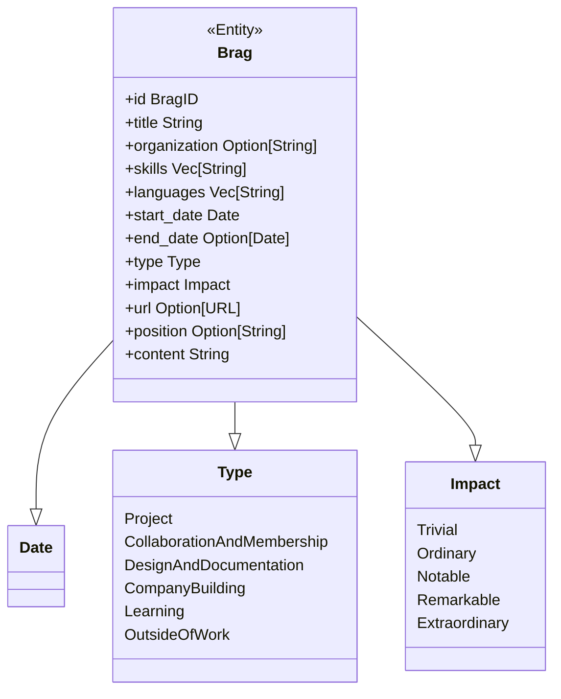

# Brax

Brax is Brag Documents inspired by https://jvns.ca/blog/brag-documents/

## Design

```mermaid
classDiagram

Brag --|> Date
Brag --|> Type
Brag --|> Impact

<<Entity>> Brag
class Brag {
    +id BragID
    +title String
    +organization Option[String]
    +skills Vec[String]
    +languages Vec[String]
    +start_date Date
    +end_date Option[Date]
    +type Type
    +impact Impact
    +url Option[URL]
    +position Option[String]
    +content String
}

class Date

class Type {
    Project
    CollaborationAndMembership
    DesignAndDocumentation
    CompanyBuilding
    Learning
    OutsideOfWork
}

class Impact {
    %%ちょっとしたこと
    Trivial

    %%普通のこと
    Ordinary

    %%少し特別なこと
    Notable

    %%かなりすごいこと
    Remarkable

    %%非常にすごいこと
    Extraordinary
}

```
