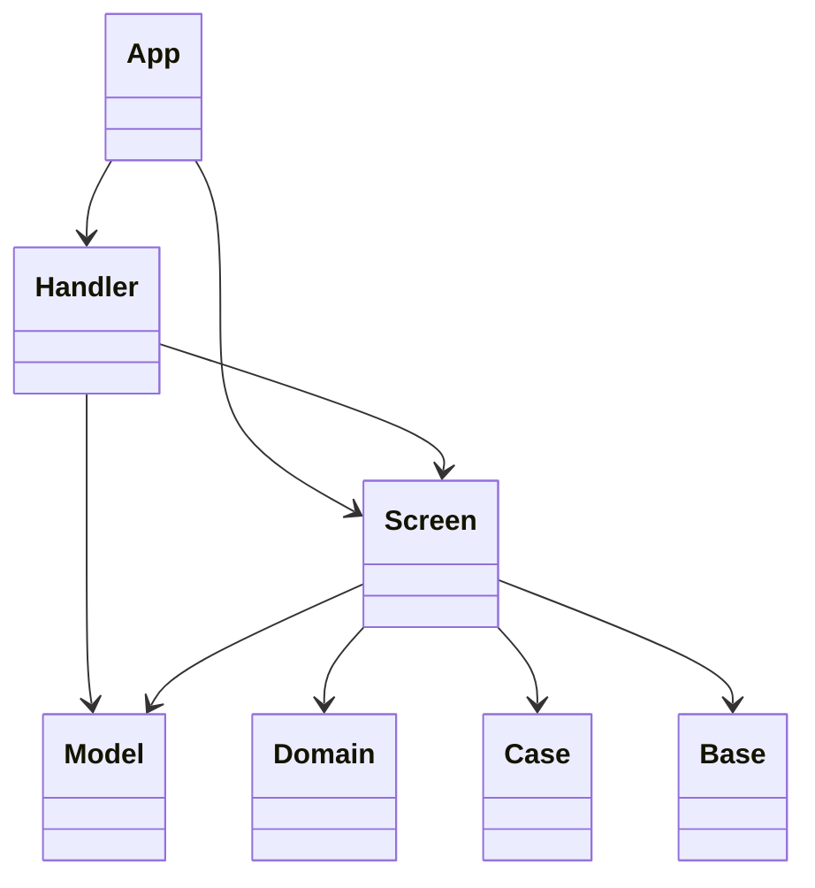

# View

## Dependencies

```mermaid
classDiagram

App --> Screen
App --> Handler
Handler --> Screen
Handler --> Model
Screen --> Model
Screen --> Domain
Screen --> Case
Screen --> Base
```

## Tasks

- [x] Handler
- [x] Cursor for unicode
- [ ] Model
- [ ] Separate widgets to files
- [ ] Refactor autocomplete
